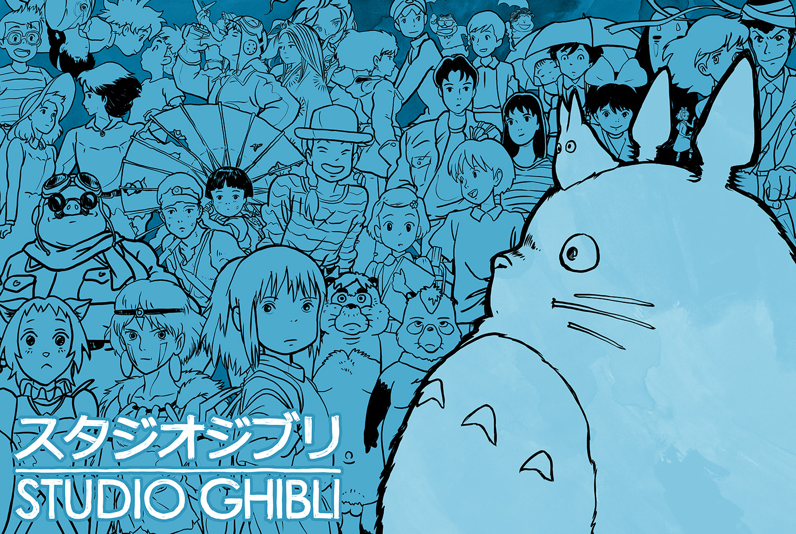

[<-- Volver al inicio](README.md)
# Temas del curso

### 29/09/2026 D.C. · Premios princesa

Studio Ghibli es un estudio de animación japonés al que le van a dar el Premio Princesa de Asturias de Comunicación y Humanidades 2026. Les han dado el premio por lo muy creativas y bonitas que son sus historias, igual que su animación y arte que está echo a mano con muchísimo esfuerzo, dedicación y talento. Explican mejor porqué les premiaron en [la página oficial de la Fundación](https://www.fpa.es/es/premios-princesa-de-asturias/premiados/2026-studio-ghibli/). Elegí este premiado porque me gustan muchísimo sus películas, llevo viéndolas toda la vida porque me las ponía mi padre y cada vez que estrenan una voy corriendo a verla porque son alucinantes.

### 18/09/2026 D.C. · Mis aficiones

Me gusta nadar. Voy a nadar de vez en cuando. Normalmente voy a nadar una vez a la semana. Siempre nadé, pero nunca competitivamente. No voy a cursillos ni nada como se puede suponer por lo que dije antes de que "Voy a nadar de vez en cuando". Me gusten los bollos preñaos.

Buscando en Github palabras cualquiera he encontrado [esto, que es un juego tipo Angry Birds hecho en Unity](https://github.com/dgkanatsios/AngryBirdsStyleGame). No tiene absolutamente nada que ver con lo de la natación ni los bollos preñaos pero la idea de esto es que aprendamos a poner un enlace a otro repositorio sea el que sea a si que no creo que eso importe demasiado.
