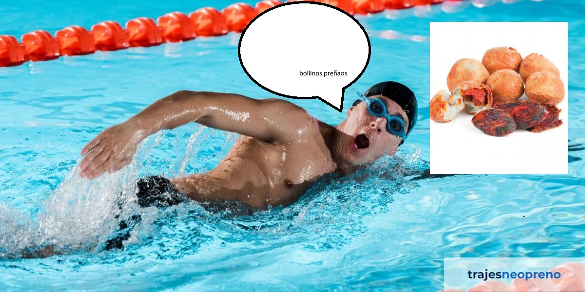

[<-- Volver al inicio](README.md)
# Temas del curso

### Mis aficiones · 18/09/2026 después de Cristo

Me gusta nadar. Voy a nadar de vez en cuando. Normalmente voy a nadar una vez a la semana. Siempre nadé, pero nunca competitivamente. No voy a cursillos ni nada como se puede suponer por lo que dije antes de que "Voy a nadar de vez en cuando". Me gusten los bollos preñaos.

Buscando en Github palabras cualquiera he encontrado [esto, que es un juego tipo Angry Birds hecho en Unity](https://github.com/dgkanatsios/AngryBirdsStyleGame). No tiene absolutamente nada que ver con lo de la natación ni los bollos preñaos pero la idea de esto es que aprendamos a poner un enlace a otro repositorio sea el que sea a si que no creo que eso importe demasiado.
